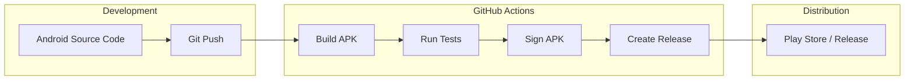

# 🚀 End-to-End CI/CD Pipeline for Android Apps with GitHub Actions  

  

## Architecture Diagram

## 📌 Overview  

This repository demonstrates how to build a fully automated **CI/CD pipeline** for Android applications using **GitHub Actions**. The pipeline ensures seamless **building, testing, and deployment**, allowing developers to focus on writing code while automation handles the rest.  

### ✅ Key Features  

- **Automated Builds** – Compile Android projects with Gradle  
- **Continuous Integration** – Run unit and instrumentation tests  
- **Artifact Management** – Store APK/AAB files securely  
- **Code Quality Checks** – Integrate with tools like Lint & SonarQube  
- **Secure Deployments** – Release to Google Play Store or Firebase  

---

## 📖 Step-by-Step Guide  

Check out the complete **blog tutorial with screenshots** here:  

---

