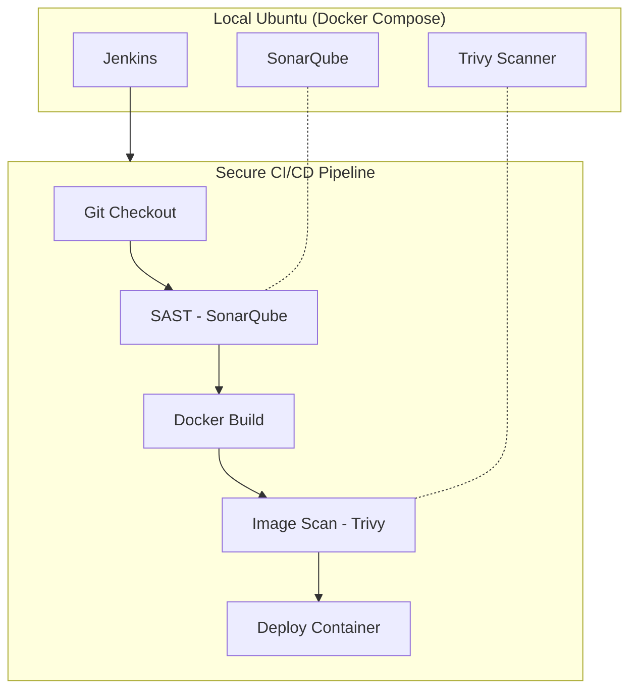

# DevSecOps Project: Secure CI/CD Pipeline on Local Ubuntu Using Jenkins, SonarQube & Trivy (100% Free)

A hands-on DevOps project that brings together Jenkins, SonarQube, and Trivy — all running locally with Docker Compose — to create a cost-free and secure CI/CD pipeline.

## **🧭 Introduction**

CI/CD is at the heart of modern DevOps. But what if you could build an **end-to-end secure pipeline** using **only open-source tools** — and run **everything** locally on a **single Ubuntu server**?

That’s exactly what I did ✅

In this tutorial, I’ll walk you through setting up a **complete DevSecOps pipeline** where:

* 🧠 **Jenkins** handles the automation

* 🧪 **SonarQube** ensures code quality

* 🛡️ **Trivy** scans for vulnerabilities

* 🐳 **Docker Compose** manages all containers

* 🖥️ **Even the deployment host is the same server**, making this setup incredibly efficient and minimal

No external VMs, no cloud cost, no complexity — just pure DevOps learning 💻✨

## **💻 System Requirements**

* OS: Ubuntu 20.04+

* RAM: 8 GB+

* Tools: Docker, Docker Compose

* Internet access for pulling images

## **🧱 Step 1: Clone the Project & Launch Jenkins + SonarQube with Docker Compose**

Before setting up our CI/CD magic, let’s get the project ready by cloning the repository and initializing the required directories and SSH keys.

### **🔁 1️⃣ Clone the Repository**

Start by cloning the DevSecOps project repo that contains our pre-configured `docker-compose.yaml` and helper scripts:

```bash
git clone https://github.com/SagarDevExpo/DevOps-Projects/tree/master/DevOps-Project-39/cicd-jenkins
cd cicd-jenkins
```

Press enter or click to view image in full size


## Architecture Diagram



### **🔐 2️⃣ Run** `start.sh` to Prepare the Jenkins Agent

This script does two important things:

* 📁 Creates required directories (`jenkins_home`, `jenkins_agent`, `jenkins_agent_keys`)

* 🔑 Generates SSH key pairs for Jenkins master ↔ agent authentication

```bash
chmod +x setup.sh
sh setup.sh
```

Press enter or click to view image in full size


✅ After this, your system is ready to launch the services!

## **🔍 How This Docker Compose Setup Works (All-in-One CI/CD Stack)**

This Docker Compose file orchestrates a fully functional DevSecOps pipeline stack — all running locally, isolated in a shared network — and ready to automate builds, scans, and deployments 💥

```yaml
version: "3.8"

services:
  # 🔧 Jenkins Master
  jenkins-master:
    image: jenkins/jenkins:lts-jdk17
    container_name: jenkins
    restart: unless-stopped
    user: 1000:1000
    ports:
      - "8080:8080"
      - "50000:50000"
    volumes:
      - jenkins_home:/var/jenkins_home:rw
      - /var/run/docker.sock:/var/run/docker.sock
      - /usr/bin/docker:/usr/bin/docker
    environment:
      - JAVA_OPTS=-Dhudson.security.csrf.GlobalCrumbIssuerStrategy=true -Djenkins.security.SystemReadPermission=true
    networks:
      - jenkins_network
    security_opt:
      - no-new-privileges:true
    read_only: true
    tmpfs:
      - /tmp:size=2G
    healthcheck:
      test: ["CMD-SHELL", "curl -f http://localhost:8080/login || exit 1"]
      interval: 1m30s
      timeout: 10s
      retries: 3

  # 🔧 Jenkins SSH Agent
  jenkins-agent:
    image: jenkins/ssh-agent
    container_name: jenkins-agent
    restart: unless-stopped
    expose:
      - "22"
    volumes:
      - /var/run/docker.sock:/var/run/docker.sock
      - /usr/bin/docker:/usr/bin/docker
      - jenkins_agent:/home/jenkins/agent:rw
      - type: bind
        source: ./jenkins_agent_keys
        target: /home/jenkins/.ssh
        read_only: true
    environment:
      - SSH_PUBLIC_KEY_DIR=/home/jenkins/.ssh
    networks:
      - jenkins_network
    security_opt:
      - no-new-privileges:true
    tmpfs:
      - /tmp:size=2G

  # 🧠 SonarQube
  sonarqube:
    container_name: sonarqube
    image: sonarqube:lts-community
    restart: unless-stopped
    depends_on:
      - sonar_db
    ports:
      - "9001:9000"
    environment:
      SONAR_JDBC_URL: jdbc:postgresql://sonar_db:5432/sonar
      SONAR_JDBC_USERNAME: sonar
      SONAR_JDBC_PASSWORD: sonar
    volumes:
      - sonarqube_conf:/opt/sonarqube/conf
      - sonarqube_data:/opt/sonarqube/data
      - sonarqube_extensions:/opt/sonarqube/extensions
      - sonarqube_logs:/opt/sonarqube/logs
      - sonarqube_temp:/opt/sonarqube/temp
    networks:
      - jenkins_network

  # 🐘 Postgres for SonarQube
  sonar_db:
    image: postgres:15
    restart: unless-stopped
    environment:
      POSTGRES_USER: sonar
      POSTGRES_PASSWORD: sonar
      POSTGRES_DB: sonar
    volumes:
      - sonar_db:/var/lib/postgresql
      - sonar_db_data:/var/lib/postgresql/data
    networks:
      - jenkins_network

# 🔗 Shared Network
networks:
  jenkins_network:
    driver: bridge

# 💾 Volumes
volumes:
  jenkins_home:
  jenkins_agent:
  sonarqube_conf:
  sonarqube_data:
  sonarqube_extensions:
  sonarqube_logs:
  sonarqube_temp:
  sonar_db:
  sonar_db_data:
```

## **🛠️ Jenkins Master (**`jenkins-master`)

* **📦 Image**: Uses `jenkins/jenkins:lts-jdk17`

* **🔌 Ports**:

* `8080`: Jenkins web UI

* `50000`: For connecting inbound agents

* **💾 Volumes**:

* `jenkins_home`: Persists Jenkins jobs, config, and plugins

* `/var/run/docker.sock`: Lets Jenkins build and run Docker containers

* `/usr/bin/docker`: Gives Jenkins CLI access to Docker commands

* **🧪 Health Check**:

* Automatically checks service availability via a `curl` login probe

* **🔒 Hardened Settings**:

* `read_only: true`: Makes the container filesystem immutable

* `tmpfs`: Stores `/tmp` in RAM for better performance and safety

* `no-new-privileges`: Prevents privilege escalation inside the container

## **⚙️ Jenkins SSH Agent (**`jenkins-agent`)

* **📦 Image**: Uses `jenkins/ssh-agent` (for connecting back to master)

* **🔐 SSH Access**:

* Mounts SSH keys from `jenkins_agent_keys` to enable secure agent communication

* **💾 Volumes**:

* `jenkins_agent`: Stores agent workspace data

* `/usr/bin/docker` + Docker socket: Enables builds inside the agent container

* **🛡️ Security First**:

* `read_only: true` + `tmpfs`: Isolates temp files in RAM

* `no-new-privileges`: Blocks processes from elevating access

## **🧠 SonarQube (**`sonarqube`)

* **📦 Image**: `sonarqube:lts-community`

* **🌐 Port Mapping**:

* Exposed as `localhost:9001 → container:9000`

* **🔗 Connects to PostgreSQL (**`sonar_db`**)**

* Configured via `SONAR_JDBC_URL` and credentials

* **💾 Volumes**:

* Persist configuration, extensions, data, logs, and temp files

* **🔄 Depends On**:

* Ensures PostgreSQL container starts **before** SonarQube

## **🐘 PostgreSQL Database (**`sonar_db`)

* **📦 Image**: `postgres:15`

* **🎯 Purpose**: Backend database for SonarQube code analysis data

* **🔐 Environment Variables**:

* Sets DB name, user, and password for SonarQube integration

* **💾 Volumes**:

* `sonar_db` and `sonar_db_data`: Persist DB schema and data

## **🔗 Common Docker Network:** `jenkins_network`

All containers share a custom **bridge network**, enabling secure internal DNS resolution and private communication between services (like `jenkins ↔ agent ↔ sonarqube ↔ postgres`).

### **🐳 3️⃣ Launch Jenkins + SonarQube + PostgreSQL with Docker Compose**

Now that everything is set, fire up the full stack:

```plaintext
docker-compose up -d
```

Press enter or click to view image in full size


## **✅ Verify Container Status After Launch**

Once you’ve started the stack using `docker compose up -d`, you’ll want to make sure everything is running properly.

🧪 **Run this command** to check the status of all containers:

```plaintext
docker ps
```

Press enter or click to view image in full size


## **⏳ Give Jenkins Some Time…**

⚠️ **Note**: Jenkins Master takes a bit of time to fully initialize — especially on the first run when it sets up plugins and internal directories.

⏲️ **Wait 1–2 minutes**, then run `docker ps` again.

Press enter or click to view image in full size


You should see:

* 🟢 `jenkins` container: showing `healthy`

* 🟢 `jenkins-agent` container: up

* 🧠 `sonarqube`: should also be healthy and accessible at `localhost:9001`

✅ Once all containers are up and healthy, you’re ready to configure Jenkins and start building pipelines!

## **🌐 Step 4: Access Jenkins Web Interface**

Your Jenkins Master is now running — let’s unlock the power of automation! 🚀

🖥️ **Open your browser** and go to:

```plaintext
http://localhost:8080
```

Press enter or click to view image in full size


You’ll be greeted by the **Jenkins Setup Wizard** 🧙‍♂️

* 🔐 Enter the initial admin password

To retrieve the initial admin password for login run the below command

```plaintext
docker exec -it jenkins cat /var/jenkins_home/secrets/initialAdminPassword
```

Press enter or click to view image in full size


Follow the guided setup: install recommended plugins, create your admin user

Press enter or click to view image in full size


Press enter or click to view image in full size


Once it finished will ask for configure admin user.Click save & continue

Press enter or click to view image in full size


Press enter or click to view image in full size


Once you completed we can see the jenkins dashboard as below

Press enter or click to view image in full size


## **🧱 Step 2: Configure jenkins agent for build**

## **🔑 1️⃣ Add SSH Credentials for Jenkins Agent**

Now let’s securely configure the **SSH authentication** so the Jenkins Master can talk to the Jenkins Agent 🚀

1. Navigate to your Jenkins dashboard.

2. Click on **Manage Jenkins**.

3. Select **Credentials**.

4. Under **(global)**, click **Add Credentials**.

5. Fill in the form:

* **Kind**: SSH Username with private key

* **Scope**: Global

* **Username**: jenkins

* **Private Key**: Enter directly

* **Key**: Paste the contents of the `id_rsa` file located inside the `jenkins_agent_keys` folder. This key is automatically generated during the setup process when you run the `setup.sh` script.

Press enter or click to view image in full size


* **ID**: can give some name to identify the credential,here i am giving build-agent

* **Description**: SSH key for Jenkins agent

* Click **OK** to save.


## **🔗 Step 4: Connect Agent to Jenkins Master**

1. In Jenkins, go to **Manage Jenkins** &gt; **Manage Nodes and Clouds**.

2. Click **New Node**.

3. Enter a name (e.g., `agent`), select **Permanent Agent**, and click create

Press enter or click to view image in full size


1. **Configure the node:**

* **Remote root directory**: `/home/jenkins/agent`

* **Labels**: `agent`

* **Launch method**: Launch agents via SSH

* **Host**: `jenkins-agent` (matches the Docker service name)

* **Credentials**: Select the credential that you have created earlier

* **Host Key Verification Strategy**: Manually trusted key verification Strategy

* Click **Save**

Press enter or click to view image in full size


**Verify Connection:**

* Jenkins will attempt to connect to the agent. If successful, the agent’s status will show as **Connected**.

Press enter or click to view image in full size


## **Step 3:Configure Jenkins Agent SSH Key for Remote Host Access**

Since we already generated the SSH key pair during the Jenkins setup (via `setup.sh`), we can reuse the **same private key** for connecting to the remote host.(in our case it is the same local ubuntu server where we running containers )

✅ Just copy the **public key** to your host machine’s `authorized_keys`.

On your **host machine**, run the following commands:

```plaintext
cat /home/user/devops-projects/cicd-jenkins/jenkins_agent_keys/id_rsa.pub >> ~/.ssh/authorized_keys
chmod 600 ~/.ssh/authorized_keys
```

Press enter or click to view image in full size


🧠 This allows Jenkins (via the agent) to SSH into the host machine securely using the existing key —

## **🚀 2️⃣ Add SSH Credentials for Remote Host Deployment**

These credentials allow Jenkins to SSH into your remote host and trigger Docker Compose commands during deployment.

➡️ Go to **Manage Jenkins → Credentials → (Global) → Add Credentials**  
Then fill out the following fields:

* **Kind**: SSH Username with private key

* **Scope**: Global

* **Username**: `user` (or your actual host system username)

* **Private Key**: Enter directly → paste the content of `id_rsa` from `jenkins_agent_keys` folder (generated by `setup.sh`)

* **ID (optional)**: `deploy-server-ssh`

* **Description**: Remote host SSH for Docker Compose deployment

## **🔌 Plugin Power-Up: Install Essential Jenkins Plugins 🚀**

> *⚙️ Go to:* ***Manage Jenkins → Plugins → Available Plugins****✅ Search and* ***Install without restart*** *for each listed plugin below.*

## **1️⃣ Eclipse Temurin Installer**

🧠 *Installs and manages JDK versions for your build environments*

## **2️⃣ SonarQube Scanner**

🔍 *Integrates Jenkins with SonarQube to analyze code quality and detect bugs*

## **3️⃣ NodeJS Plugin**

🌐 *Allows Jenkins to install and use specific Node.js versions in pipelines*

## **4️⃣ Docker Plugin Suite (Install all individually) 🐳**

*Enables full Docker support in Jenkins — from simple builds to full pipelines*

* ✅ **Docker Plugin**

* ✅ **Docker Commons**

* ✅ **Docker Pipeline**

* ✅ **Docker API**

* ✅ **Docker Build Step**

## **5️⃣ SSH Agent Plugin**

🔐 *Use SSH credentials securely to connect and execute on remote machines*

Press enter or click to view image in full size


## **🧠 Step 4: Access & Secure Your SonarQube Dashboard**

🎉 **SonarQube is now up and running on port** `9001`

🔗 **Open your browser** and visit:  
👉 [`http://localhost:9001/`](http://localhost:9001/)

🔐 **Login using default credentials**:

* **Username**: `admin`

* **Password**: `admin`

⚠️ **Important:**  
You’ll be prompted to **change the default password** on your first login.  
Make sure to choose a strong one! 🔒

Press enter or click to view image in full size


## **Step5: Integrating Jenkins with SonarQube**

## **🔐 1: Create a Global Token in SonarQube**

1. Log in to SonarQube with the admin user

2. In the top right corner, click your username(Here it is Administrator)→ choose **“My Account”**.

Press enter or click to view image in full size


1. Go to the **“Security”** tab.

2. Under **Generate Tokens**:

* **Name**: enter something like `jenkins-global-token`

* **Type**: leave it as **User Token**

* **Expires In**: choose `No expiration` (recommended for CI usage)

1. Click **Generate**, and **copy the token** (you won’t be able to see it again later).

✅ This token allows Jenkins to push analysis results to **any project** that the user has access to.

Press enter or click to view image in full size


After previous step, you’ll see the generated **token**. **Save it** somewhere to not loose. We’ll need that for later.

## **🔐 Why Use a Global Token?**

* **🔁 Reusable** across all projects — no need to generate separate tokens per project

* **🧹 Easy to manage** — one place to rotate/update

* **✅ Secure** — stored in Jenkins as a credential (not hardcoded)

* **⚙️ Scalable** — works even as your pipeline or project count grows

## **🧱 Step 2: Create the Project (Using the Global Token)**

1. Navigate to **Projects → Create Project**.

2. Select **Manually**.

Press enter or click to view image in full size


3.Fill:

* **Project Key**: blog-app

* **Display Name**: blog-app

* **Main branch name:** In my case it is main.But in some projects it could be **ma**ster or dev as well

Press enter or click to view image in full size


4.On the next screen, when you’re asked:

> ***How do you want to analyze your project?****✅ Choose:* `Locally`

1. It will now prompt:

> ***Use existing token****🔐 Paste your* ***global token*** *here*

🟢 **DO NOT click Generate Token** — instead, **choose “Use existing token”** and paste the global one you created in Step 1.

This completes the project setup and links your global token to it.


Press enter or click to view image in full size


> *Note: You can see the Run analysis on your project options after giving the token.Just ignore the further steps .Will add the necessary commands in Jenkinsfile*

## **🧾 3. Add SonarQube Token to Jenkins Credentials**

1. In Jenkins, go to `Manage Jenkins` &gt; `Credentials`.

2. Select the appropriate domain (e.g., `(global)`).

3. Click **Add Credentials**.

4. Choose **Secret text** as the kind.

5. Paste the SonarQube token into the `Secret` field that we created from the step Create a Global Token in SonarQube

6. Provide an ID (e.g., sonar-token) and a description.

7. Click **Create** to save.

Press enter or click to view image in full size


## **⚙️ 4. Configure SonarQube Server in Jenkins**

1. Navigate to `Manage Jenkins` &gt; `Configure System`.

2. Scroll down to the **SonarQube servers** section.

3. Click **Add SonarQube**.

4. Provide a name for the server (e.g. sonar-server).

5. Enter the SonarQube server URL ([`http://sonarqube:9000`](http://sonarqube:9000/)).

> *✅ Use the Docker container name* `sonarqube` — this works because both Jenkins and SonarQube are running on the same Docker Compose network (`jenkins_network`), and Docker handles the DNS resolution automatically

**6.Server authentication token**:  
Select the credential ID you created earlier — e.g., `sonar-token`

7.Check **Enable injection of SonarQube server configuration as build environment variables**.

> *✅* ***“Enable injection of SonarQube server configuration as build environment variables”***
>
> *When checked, Jenkins* ***automatically injects*** *environment variables like:*
>
> `SONAR_HOST_URL`
>
> `SONAR_AUTH_TOKEN`
>
> `SONAR_SCANNER_HOME`
>
> *These can then be* ***used inside shell scripts*** *or pipeline steps* ***without hardcoding****.Click* ***Save*** *to apply the changes.*

Press enter or click to view image in full size


## **6\. Installing Required Tools in Jenkins**

To make Jenkins ready for CI/CD magic ✨, we need to equip it with essential tools. These tools empower Jenkins to **build**, **test**, **scan**, and **deploy** applications across the pipeline.

📍 Navigate to:

> ***Jenkins Dashboard → Manage Jenkins → Global Tool Configuration***

Now, configure the following:

## **🔍 1. 🧪 SonarQube Scanner**

✅ Required for performing static code analysis on your project directly from Jenkins

🔧 **Steps to configure:**

Navigate to the **SonarQube Scanner** section → Click ➕ **Add SonarQube Scanner**  
🏷️ **Name**: `sonar-scanner`  
✅ **Check**: Install automatically  
🔽 **Installer source**: Install from **Maven Central**

📌 **Version**: `7.0.2.4839` *(or latest available)*

📌 Jenkins will now auto-download and manage the SonarQube Scanner version needed for your pipeline.

🧠 This ensures that your pipeline always has a ready-to-go scanner for SonarQube analysis without needing to install anything manually on your host.

Press enter or click to view image in full size


## **2.☕ JDK 21 (Temurin)**

> *✅ Required to compile Java-based projects and run tools like SonarQube Scanner in Jenkins*

🔧 Steps to configure:

* Navigate to the **JDK** section → Click **➕ Add JDK**

* 🏷️ **Name**: `jdk21`

* ✅ **Check**: **Install automatically**

* 🔽 Installer source: **Install from adoptium.net**

* 📌 Select version: `21.0.4` *(or latest available under JDK 21)*

🧠 This setup ensures Jenkins downloads and uses **Java 21** from the official Adoptium build

Press enter or click to view image in full size


## **3.🟩 NodeJS 21.0.0**

> *✅ Required for building frontend applications (React, Vue, Angular) or running JavaScript-based tools in Jenkins*

🔧 Steps to configure:

* Scroll to the **NodeJS** section → Click **➕ Add NodeJS**

* 🏷️ **Name**: `node21`

* ✅ **Check**: **Install automatically**

* 🔽 Installer source: **Install from nodejs.org**

* 📌 Select version: `21.0.0`

🧠 This configuration allows Jenkins to download and manage **Node.js v21.0.0** directly from the official Node.js website

Press enter or click to view image in full size


## **4.🐳 Docker (Latest)**

> *✅ Essential for building, running, and scanning Docker containers directly from Jenkins pipelines*

🔧 Steps to configure:

* Scroll to the **Docker** section → Click **➕ Add Docker**

* 🏷️ **Name**: `docker`

* ✅ **Check**: **Install automatically**

* 🔽 Installer source: **Download from docker.com**

* 📌 Select version: *(latest available or your preferred Docker version)*

🧠 With this setup, Jenkins automatically installs Docker from the official source — no manual setup or system-level install required.

* Ensure Docker is already installed on your system (`/usr/bin/docker`)

> *📌 You’ve already mounted the Docker socket in your Jenkins Compose file, so this config links Jenkins with the host Docker engine.*

Press enter or click to view image in full size


**Apply and Save:**

1. Once all tools are configured, click **Apply** and **Save**.

## **Step 7: Configure Essential Credentials in Jenkins for Secure CI/CD**

### **🧾 1. 🔐 Generate a Docker Hub Access Token**

Go to: Docker Hub → Account Settings → Security → Access Tokens

* Click ➕ **“New Access Token”**

* Give it a meaningful name (e.g.,`jenkins-ci`)

* Click **Generate**

* 📋 **Copy the token** (you won’t see it again!)

Press enter or click to view image in full size


### **🧰 2. 💼 Add the Token to Jenkins Credentials**

Go to your Jenkins Dashboard:  
➡️ **Manage Jenkins → Credentials →** **Global Credentials (unrestricted) → Add Credentials**

* 👇 Select: **Kind:** `Secret text`

* ✏️ **Secret:** *(Paste the Docker token here)*

* 🏷️ **ID:** `docker-hub-token` *(or any unique identifier)*

* 💬 Description: `Docker Hub Personal Access Token for Jenkins`

✅ Create it!

Press enter or click to view image in full size


## **🛠️ Step-8:Grant Docker Access to Jenkins**

To enable Jenkins (inside the container) to communicate with Docker on the host:

```plaintext
sudo chmod 666 /var/run/docker.sock
```

Press enter or click to view image in full size


> *⚠️* ***Why this is needed?****  
> This sets read/write permissions on the Docker socket so Jenkins containers can:*

* 🐳 Build Docker images

* 🔍 Scan them with Trivy

* 🚀 Push to Docker Hub

> *💡* ***Note****: This is safe for* ***local testing environments****, but* ***not recommended for production****.*

## **🌐 About the Application: Wanderlust — A 3-Tier Web App**

🧭 **Wanderlust** is a lightweight **3-tier web application** designed to demonstrate full CI/CD automation using open-source DevOps tools. It features:

### **📦 Architecture:**

* **Frontend**: A modern web UI built with ReactJS (Node.js 21), offering a clean and responsive interface for user interactions.

* **Backend**: A RESTful API developed using Node.js and Express.js, handling business logic and communication with the database.

* **Database**: MongoDB used as the NoSQL data store for posts or travel-related content.

## **🔁 Set Up Your Jenkins CI/CD Pipeline — Automation Begins Here!**

Now that your DevOps environment is all set 🎯, it’s time to **automate your entire workflow** — from code checkout to deployment — using a Jenkins pipeline.

💡 **What will this pipeline do?**  
✅ Clone your code from GitHub  
✅ Run static code analysis via SonarQube  
✅ Perform vulnerability scans with Trivy  
✅ Build & push Docker images  
✅ Deploy the app — hands-free!

### **Step 9📌 Let’s Create the Pipeline Job**

🖥️ **Navigate to Jenkins Dashboard:**

1. ➕ Click on **“New Item”**

2. 🏷️ **Name your project** — e.g., `wanderlust-deploy`

3. 🧱 Choose **“Pipeline”** as the project type

4. ✅ Click **OK** to continue

Press enter or click to view image in full size


**Define Pipeline Syntax:**

* In the **Pipeline** section, select **Pipeline script** and add the following pipeline code:

```go
pipeline {
    agent { label 'agent' }

    tools {
        jdk 'jdk21'
        nodejs 'node21'
    }

    environment {
        IMAGE_TAG = "${BUILD_NUMBER}"
        BACKEND_IMAGE = "SagarDevExpo/wanderlust-backend"
        FRONTEND_IMAGE = "SagarDevExpo/wanderlust-frontend"
    }

    stages {
        stage('SCM Checkout') {
            steps {
                git branch: 'main', url: 'https://github.com/SagarDevExpo/devops-projects.git'
            }
        }

        stage('Install Dependencies') {
            steps {
                dir('wanderlust-3tier-project/backend') {
                    sh "npm install || true"
                }
                dir('wanderlust-3tier-project/frontend') {
                    sh "npm install"
                }
            }
        }

        stage('Run SonarQube') {
            environment {
                scannerHome = tool 'sonar-scanner'
            }
            steps {
                withSonarQubeEnv('sonar-server') {
                    sh """
                        ${scannerHome}/bin/sonar-scanner \
                        -Dsonar.projectKey=blog-app \
                        -Dsonar.projectName=blog-app \
                        -Dsonar.sources=wanderlust-3tier-project
                    """
                }
            }
        }

        stage('Docker Build') {
            steps {
                dir('wanderlust-3tier-project') {
                    sh '''
                        docker build -t ${BACKEND_IMAGE}:${IMAGE_TAG} ./backend
                        docker build -t ${FRONTEND_IMAGE}:${IMAGE_TAG} ./frontend
                    '''
                }
            }
        }

        stage('Scan with Trivy') {
            steps {
                script {
                    def images = [
                        [name: "${BACKEND_IMAGE}:${IMAGE_TAG}", output: "trivy-backend.txt"],
                        [name: "${FRONTEND_IMAGE}:${IMAGE_TAG}", output: "trivy-frontend.txt"]
                    ]

                    for (img in images) {
                        echo "🔍 Scanning ${img.name}..."
                        sh """
                            mkdir -p wanderlust-3tier-project
                            docker run --rm \
                                -v /var/run/docker.sock:/var/run/docker.sock \
                                -v \$HOME/.trivy-cache:/root/.cache/ \
                                -v \$WORKSPACE/wanderlust-3tier-project:/scan-output \
                                aquasec/trivy image \
                                --scanners vuln \
                                --severity HIGH,CRITICAL \
                                --exit-code 0 \
                                --format table \
                                ${img.name} > wanderlust-3tier-project/${img.output}
                        """
                    }
                }
            }
        }

        stage('Push to Docker Hub') {
            steps {
                withCredentials([string(credentialsId: 'docker-hub-token', variable: 'DOCKER_TOKEN')]) {
                    sh '''
                        echo "${DOCKER_TOKEN}" | docker login -u rjshk013 --password-stdin
                        docker push ${BACKEND_IMAGE}:${IMAGE_TAG}
                        docker push ${FRONTEND_IMAGE}:${IMAGE_TAG}
                    '''
                }
            }
        }

        stage('Remote Deploy on Host with Docker Compose') {
            steps {
                sshagent(credentials: ['deploy-server-ssh']) {
                    sh '''
                        echo "🚀 Deploying on host with docker compose..."
                        ssh -o StrictHostKeyChecking=no user@172.18.0.1 '
                            cd /home/user/devops-projects/wanderlust-3tier-project &&
                            docker compose build &&
                            docker compose up -d
                        '
                    '''
                }
            }
        }
    } 
    post {
        always {
            archiveArtifacts artifacts: 'wanderlust-3tier-project/trivy-*.txt', fingerprint: true
        }
    }
}
```

## **🛠️ Understanding the Jenkinsfile (Wanderlust CI/CD Pipeline)**

This Jenkinsfile automates the complete **build → scan → deploy** lifecycle of your Wanderlust project.

Here’s a **step-by-step overview** of what it does:

Press enter or click to view image in full size


## **🔥 Key Highlights**

* **Secure Build**: Code quality is validated by SonarQube before proceeding to deployment ✅

* **Security First**: Images are scanned by Trivy before pushing to Docker Hub 🛡️

* **Fully Automated**: No manual steps — from Git pull to live deployment 🚀

* **Secrets Handling**: Docker Hub credentials and SonarQube token are injected via Jenkins Credentials Manager 🔒

Press enter or click to view image in full size


## **🔧 Update Jenkinsfile with Your Values**

Before using the pipeline, **replace the following placeholders** with your own values:

* rjshk013 → your actual Docker Hub username

* [`https://github.com/`](https://github.com/rjshk013/devops-projects)`rjshk013/devops-projects.git` → use the provided repo or your own cloned GitHub repo

* user@172.18.0.1-Replace with your host username & ip

That’s it — just plug in your details and you’re good to go! 🚀

## **🚀 1️⃣0️⃣ Triggering the Pipeline & Viewing Results**

Once your Jenkins pipeline is fully configured, it’s time to fire it up! 💥

🛠️ **Steps to Run the Pipeline**:

🔘 Go to the **Jenkins Dashboard** and click on your job (e.g., `wanderlust-deploy`).

▶️ Click **“Build Now”** on the left panel to trigger the pipeline.

📜 Navigate to **“Build History”**, and click on the latest build number (e.g., `#1`).

📈 In the build details page:

* ✅ Click **Pipeline Steps** or **Pipeline Overview** to visualize each stage.

* 🖥️ Click **Console Output** to follow the logs in real-time — great for debugging and validation.

Press enter or click to view image in full size


Press enter or click to view image in full size


Press enter or click to view image in full size


Press enter or click to view image in full size


## **✅ 1️⃣1️⃣ Post-Pipeline Verification: Confirm Everything Worked! 🕵️‍♂️**

After the pipeline runs successfully, it’s time to verify each key milestone to ensure your CI/CD process worked perfectly.

### **🐳 Docker Image Push Confirmation**

✅ Go to your Docker Hub repository.

🔍 Navigate to:

* `wanderlust-backend`

* `wanderlust-frontend`

📌 Check if the **latest image tags (build numbers)** are successfully listed and match the ones from the Jenkins pipeline.

Press enter or click to view image in full size


### **🧠 SonarQube Code Quality Analysis**

📍 Open your browser and go to:  
`http://localhost:9001` (or your configured SonarQube URL)

📊 Navigate to:

* `Projects` → `blog-app`

✅ You should see a **recent analysis** with quality gate status, bugs, code smells, duplications, etc.

Press enter or click to view image in full size


Press enter or click to view image in full size


### **🛡️ Trivy Vulnerability Scan**

📂 Go back to Jenkins UI → your job → latest build → **Artifacts**

📎 You’ll find files like:

* `trivy-backend.txt`

* `trivy-frontend.txt`

🔍 Open them and look for:

* Severity levels: `CRITICAL`, `HIGH`

* Confirm no critical issues OR review and mitigate them accordingly.


## **🧪 1️⃣2️⃣ Test the Deployed Application Locally**

🚀 Once your CI/CD pipeline has completed successfully, your application is now live and accessible on your **host machine**. Here’s how to verify:

### **🌐 Access Frontend:**

🔗 Open your browser and go to:  
[`http://localhost:5173/`](http://localhost:5173/)

You should see your React-based frontend app running 🎉

Press enter or click to view image in full size


### **🛠️ Access Backend (API):**

🔗 Open another tab and hit:  
[`http://localhost:5000/`](http://localhost:5000/)


## **🐳 Verify Running Containers on Host Machine**

To ensure both your **frontend** and **backend** services are up and running after deployment, run the following command on your host terminal:

docker ps

Press enter or click to view image in full size


## **🔗 GitHub Repository**

🗂️ You can find the **complete source code, Jenkinsfile, Docker Compose setup, and scripts** used in this article right here:

👉 [**GitHub — Wanderlust 3-Tier DevSecOps CI/CD Project**](https://github.com/SagarDevExpo/DevOps-Projects/tree/master/DevOps-Project-39)

## **✅ Conclusion: Your DevSecOps Lab Is Now Live 🚀**

You’ve just built a **real-world CI/CD pipeline** that:

* 🔧 Automates code building and testing with **Jenkins**

* 🧠 Ensures code quality through **SonarQube**

* 🛡️ Scans for vulnerabilities using **Trivy**

* 🐳 Runs entirely in **Docker Compose**

* 🖥️ Deploys applications seamlessly on the **same local server**

And the best part? You did it all with **zero cloud cost** — 100% open-source, local, and production-grade ready! 💯

## **🎯 What’s Next?**

* 🧪 Add unit and integration tests for better quality gates

* ☁️ Try extending this setup to a cloud provider like AWS or Azure

* 📊 Integrate monitoring tools like **Prometheus** and **Grafana**

* 📦 Explore Kubernetes and Helm for container orchestration

This setup isn’t just a tutorial — it’s a **launchpad** into real-world DevOps workflows. Now you’re equipped to experiment, expand, and evolve your own **secure software delivery system** 🔐💻

