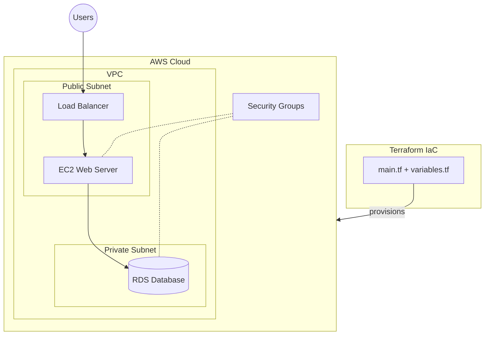

# 🏗️ Two-Tier AWS Infrastructure with Terraform  


## Architecture Diagram



## 📌 Overview  

This project demonstrates a **Two-Tier architecture on AWS** using **Terraform** for Infrastructure as Code (IaC). It follows a modular and security-enhanced approach to create a **scalable, secure, and maintainable** infrastructure.  

### ✅ Key Features  

- **Modular Architecture** – Reusable Terraform modules for better management  
- **Infrastructure as Code (IaC)** – Automate AWS resource provisioning  
- **Security Best Practices** – IAM roles, policies, and WAF integration  
- **Scalability & High Availability** – Auto Scaling, Load Balancing, and Route 53  
- **Database Integration** – Managed Amazon RDS deployment  
- **SSL & CDN Optimization** – Secure connections and content acceleration  

---

## 📖 Step-by-Step Guide  

📌 **Read the full tutorial with screenshots**:  

---

## 🚀 Getting Started

### Prerequisites

- **Terraform** >= 1.0.0
- **AWS CLI** configured with appropriate permissions
- **An AWS account** with sufficient IAM permissions

### 1️⃣ Clone the Repository  

```bash
git clone https://github.com/SagarDevExpo/DevOps-Projects
cd DevOps-Projects/DevOps-Project-11/
```  

### 2️⃣ Configure Variables

⚠️ **Important**: Before deploying, update the `variables.tfvars` file:
- Change `RDS-PWD` to a secure password
- Update `DOMAIN-NAME` to your actual domain
- Modify other values as needed for your environment

### 3️⃣ Initialize and Apply Terraform  

```bash
terraform init
terraform plan -var-file=variables.tfvars
terraform apply -var-file=variables.tfvars --auto-approve
```  

### 4️⃣ Cleanup (Destroy Infrastructure)  

```bash
terraform destroy -var-file=variables.tfvars --auto-approve
```  

---

## 🔧 Configuration Files

- **`main.tf`** - Main Terraform configuration with module calls
- **`variables.tf`** - Variable declarations
- **`variables.tfvars`** - Variable values (update these before deployment)
- **`backend.tf`** - Terraform backend and provider configuration
- **`modules/`** - Reusable Terraform modules

---

## 🏗️ Project Architecture Highlights  

### 🔹 **Networking & Security**  

✅ **VPC & Subnets** – Securely isolated environment for your application  
✅ **IAM & Role-Based Access Control** – Fine-grained security permissions  
✅ **AWS WAF** – Protect against common web threats  

### 🔹 **Compute & Scaling**  

✅ **Auto Scaling Group** – Dynamic scaling based on demand  
✅ **Application Load Balancer (ALB)** – Efficient traffic distribution  
✅ **EC2 Instances** – Reliable computing power  

### 🔹 **Storage & Database**  

✅ **Amazon RDS** – Managed database for scalability and reliability  
✅ **S3 Buckets** – Secure storage for application assets  

### 🔹 **Networking & Optimization**  

✅ **Amazon Route 53** – Scalable domain name system (DNS)  
✅ **Amazon CloudFront (CDN)** – Faster content delivery worldwide  
✅ **SSL/TLS Encryption** – Secure communication with ACM  

---

